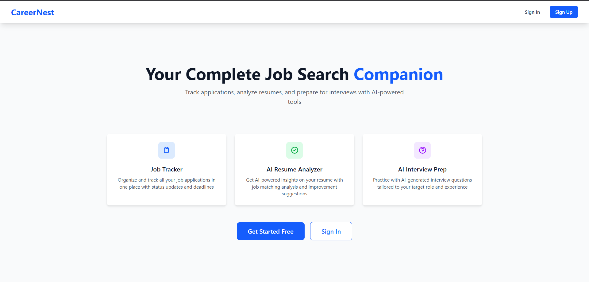
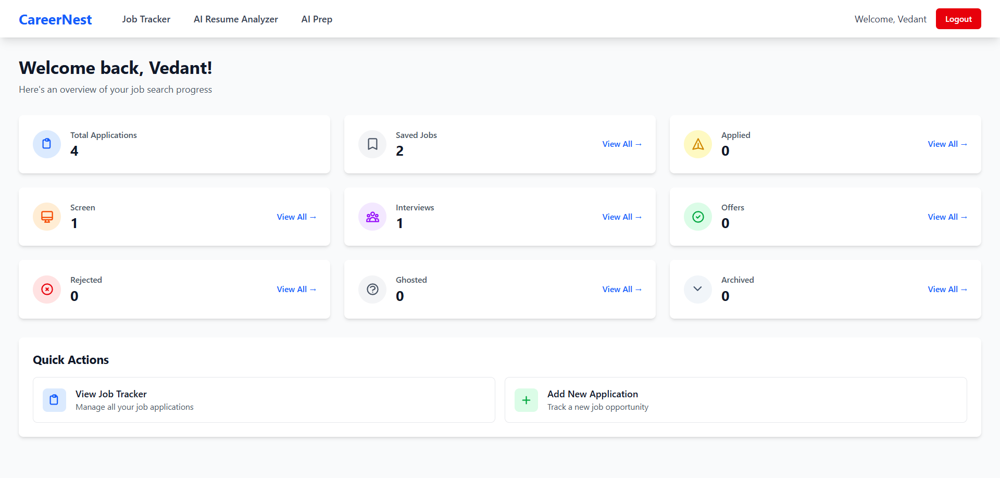
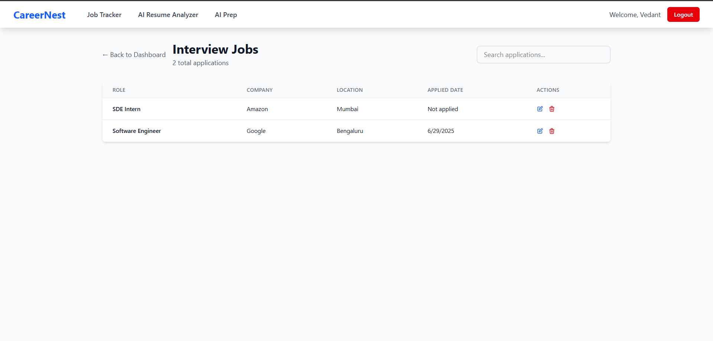
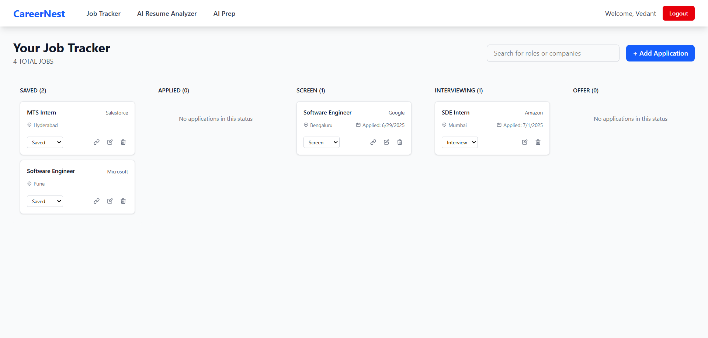
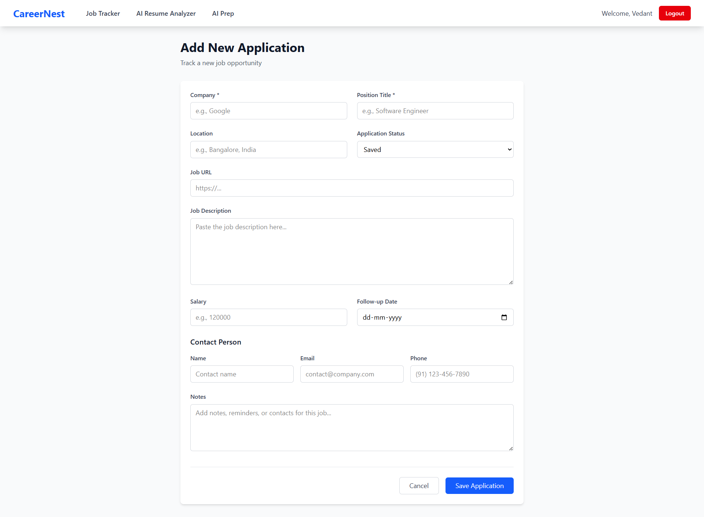
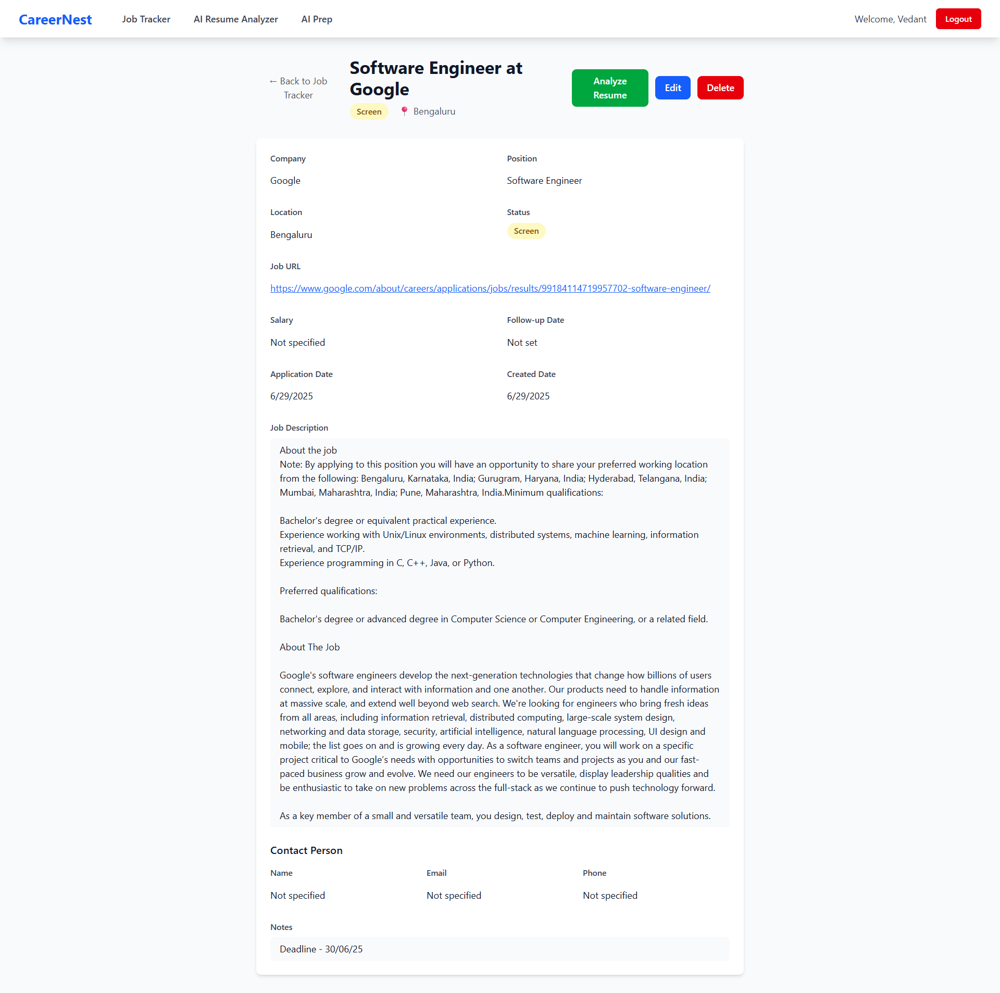
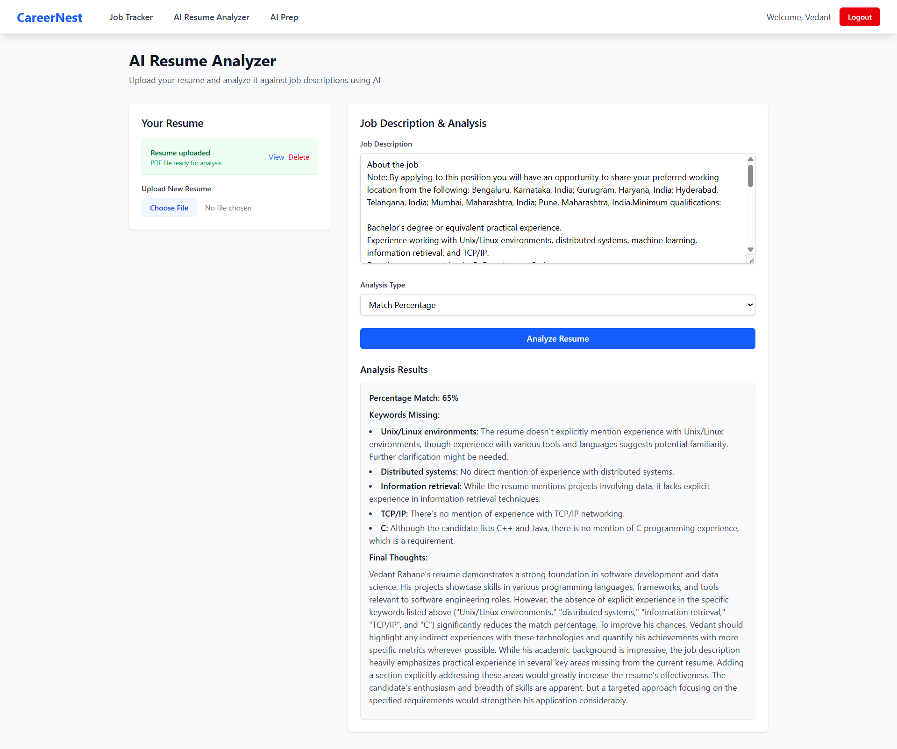
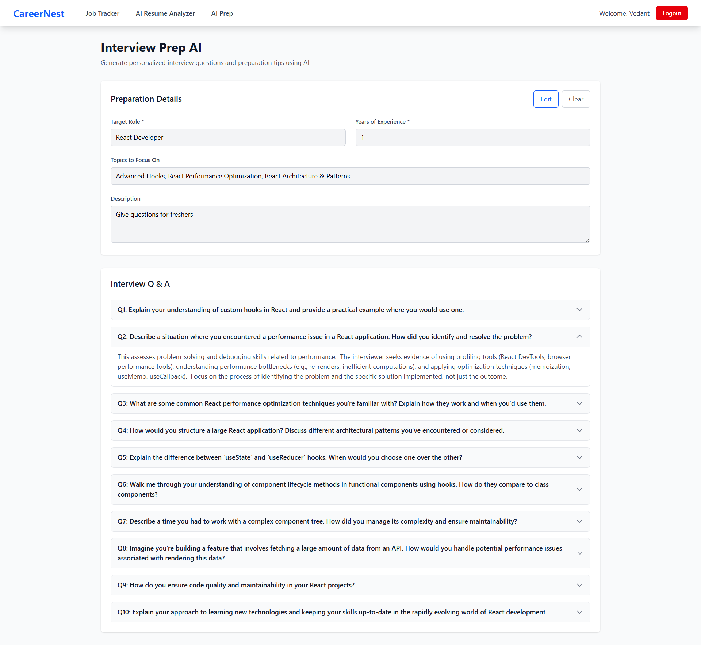

# CareerNest

Your Complete Job Search Companion

CareerNest is an all-in-one platform to streamline your job search journey. Effortlessly track job applications, analyze your resume, and prepare for interviews with AI-powered tools—all in one place.

---

## Features

- **Job Tracker**: Organize and manage all your job applications with status updates, deadlines, and notes.
- **Add & Edit Applications**: Add new job applications, update details, and keep track of follow-ups and contacts.
- **Status Dashboard**: Visual overview of your job search progress by application status (Saved, Applied, Interview, Offer, etc.).
- **Resume Upload & Management**: Securely upload, view, and delete your resume (PDF, stored in AWS S3).
- **AI Resume Analyzer**: Get AI-powered insights on your resume, including job matching, skills assessment, keyword analysis, and match percentage.
- **AI Interview Prep**: Generate personalized interview questions and preparation tips tailored to your target role and experience.
- **User Authentication**: Register, login, and manage your account securely.

---

## Technologies Used

### Frontend
- **React 19**
- **Vite** (build tool)
- **Tailwind CSS** (utility-first CSS framework)
- **React Router DOM** (routing)
- **Axios** (API requests)
- **React Markdown** & **Remark GFM** (rendering markdown)
- **ESLint** (linting)

### Backend
- **Node.js** & **Express 5**
- **MongoDB** (with Mongoose ODM)
- **JWT** (authentication)
- **AWS S3** (resume storage)
- **Multer** (file uploads)
- **CORS**, **dotenv**, **cookie-parser**

### AI Microservices
- **Python 3**
- **Flask** & **Flask-CORS**
- **Google Generative AI (Gemini API)**
- **PyMuPDF** (PDF parsing)
- **python-dotenv**

---

## Screenshots

| Feature | Screenshot |
|---------|------------|
| Landing Page |  |
| Dashboard |  |
| Applications by Status |  |
| Job Tracker |  |
| Add New Application |  |
| Job Application Details |  |
| AI Resume Analyzer |  |
| AI Interview Prep |  |

---

## Quick Start

### Prerequisites
- Node.js (v18+ recommended)
- Python 3.8+
- MongoDB instance (local or cloud)
- AWS S3 bucket & credentials (for resume storage)
- Google Generative AI API key

### 1. Clone the repository
```bash
git clone <your-repo-url>
cd CareerNest
```

### 2. Setup Environment Variables
- Copy `.env.example` (if available) or create `.env` files in `backend/` and `ai_microservices/` with the following:

**Backend (`backend/.env`)**
```
MONGODB_URI=your_mongodb_uri
JWT_SECRET=your_jwt_secret
AWS_ACCESS_KEY_ID=your_aws_access_key
AWS_SECRET_ACCESS_KEY=your_aws_secret_key
AWS_REGION=us-east-1
AWS_S3_BUCKET_NAME=your_bucket_name
NODE_ENV=development
PORT=10000
```

**AI Microservices (`ai_microservices/.env`)**
```
GOOGLE_API_KEY=your_google_generativeai_key
PORT=10001
```

### 3. Install Dependencies
- **Frontend**
  ```bash
  cd frontend
  npm install
  ```
- **Backend**
  ```bash
  cd ../backend
  npm install
  ```
- **AI Microservices**
  ```bash
  cd ../ai_microservices
  pip install -r requirements.txt
  ```

### 4. Run the Application
- **Backend**
  ```bash
  cd backend
  npm run dev
  ```
- **AI Microservices**
  ```bash
  cd ai_microservices
  python services.py
  ```
- **Frontend**
  ```bash
  cd frontend
  npm run dev
  ```

### 5. Access the App
- Frontend: [http://localhost:5173](http://localhost:5173)
- Backend API: [http://localhost:10000/api](http://localhost:10000/api)
- AI Microservices: [http://localhost:10001/api](http://localhost:10001/api)

---
